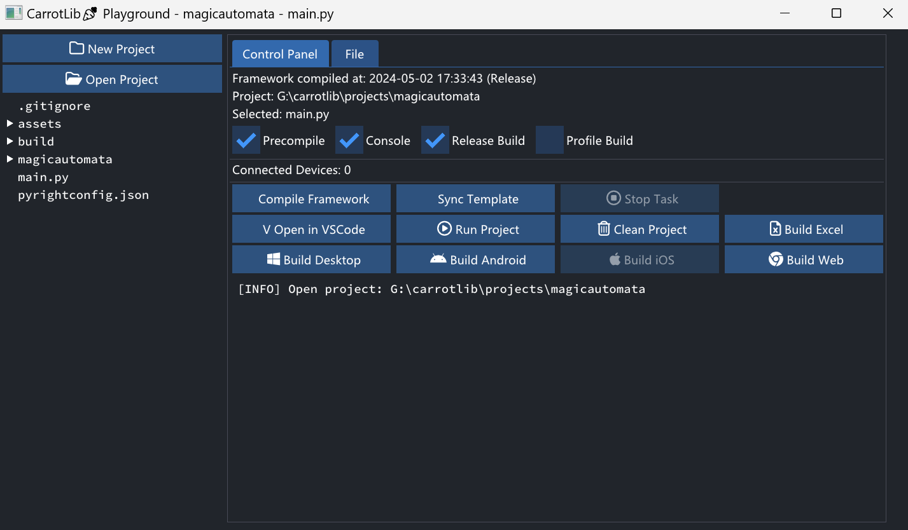

# carrotlib🥕

## Caveat

+ This project is NOT ready for production.
+ This project mainly serves for my own games.

## Install requirements
```
pip install -r requirements.txt
```

## Run the playground for everything
```
python -m playground
```



## Third party libraries

This project uses the following libraries:

+ [pocketpy](https://github.com/blueloveTH/pocketpy)
+ [raylib](https://github.com/raysan5/raylib)
+ [box2d](https://github.com/erincatto/box2d)